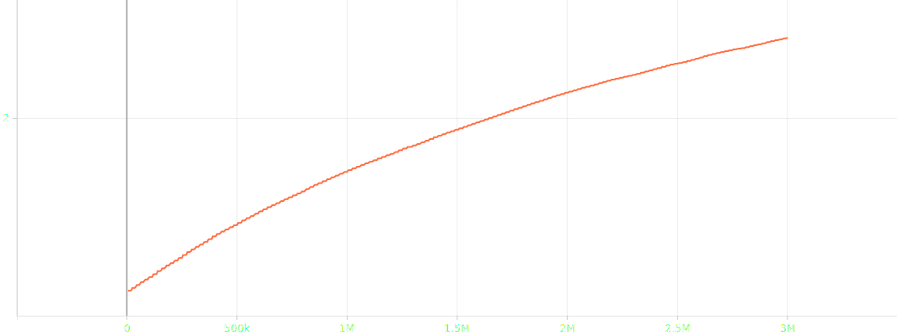

# Heist and Seek: Tutorial AI-powered VR Bank Heist

## Inleiding

*Heist and Seek* is een VR-bankoverval waarin de speler kunstvoorwerpen,
geld en kluisinhoud moeten stelen terwijl een met ML-Agents (PPO + LSTM)
getrainde AI-bewaker patrouilleert, op zicht en geluid reageert en de speler
binnen vijf minuten probeert te vangen.

Deze tutorial beschrijft stap voor stap hoe de simulatie en de bewaker-agent
vanaf nul opgebouwd zijn, welke observaties, acties en beloningen de agent
gebruikt, hoe de scene is ingericht en welke trainings-iteraties tot het
huidige model hebben geleid. Na het volgen van de tutorial weet je hoe je
een VR-stealth-spel met een AI tegenstander opzet in Unity 6 met
ML-Agents 1.1.0 en de Unity XR Interaction Toolkit.

## Methoden

### Installatie en versies

| Onderdeel | Versie |
|---|---|
| Unity Editor | 6000.3.9f1 (Unity 6) |
| Universal Render Pipeline | 17.3.0 |
| XR Interaction Toolkit | 3.4.1 |
| OpenXR Plugin | 1.16.1 |
| Meta-OpenXR | 2.5.0 |
| AndroidXR-OpenXR | 1.2.0 |
| XR Hands | 1.7.3 |
| AI Navigation (NavMesh) | 2.0.12 |
| Input System | 1.18.0 |
| Unity ML-Agents (Unity-package) | 4.0.3 |
| Unity ML-Agents (Python) | mlagents 1.1.0 |
| PyTorch | 2.12.0 (CPU-build) |
| Conda-omgeving | `mlagents-bank` |
| Headset (build-target) | Meta Quest 3S |

De installatie van Unity en de standaard XR-pipeline volgt de
cursusinstructies; alleen de ML-Agents Python-stack en de XR Interaction
Toolkit zijn extern toegevoegd (Unity Technologies, 2024).

### Verloop van het spel

1. De speler start als overvaller in een verlaten bank. De timer staat op
   300 seconden.
2. De speler verkent het pand, grijpt loot-objecten (`XRGrabInteractable`)
   en legt deze in de `DropZone`. Iedere afgeleverde buit verhoogt de score, verschillende buit heeft een andere waard / score.
3. 1 willekeurige deposit is bij start "gealarmeerd", daar aankomen
   geeft de bewaker extra reward en triggert verhoogde alertheid.
4. Voetstappen, gegrepen objecten en omgevingsgeluiden genereren
   `NoiseEvents` die de AI via de `HeistEnvController` ontvangt als hij in range is.
5. De ronde eindigt op één van drie manieren:
    - **Win**: de speler bereikt de `SafeZone` en activeert
      `ExtractionButton` met voldoende buit.
    - **Tijd voorbij**: de timer loopt af.
    - **Betrapt**: de bewaker raakt de speler aan (afstand < 1 m).
6. Het `GameUI`-eindscherm toont titel, totaalwaarde en restende tijd. Een
   *Play Again*-knop herstart de scène.

### Observaties, acties en beloningen

#### Observaties (17 vector + 65 ray = 82 inputs)

De `BankGuardAgent` verzamelt per stap een vaste vector-observatie en
laat de `RayPerceptionSensorComponent3D` als child-sensor automatisch
ray-observaties toevoegen.

| # | Vector-observatie | Bron |
|---|---|---|
| 1-2 | `sin(yaw)`, `cos(yaw)` van de bewaker | eigen rotatie |
| 3-4 | velocity X en Z, genormaliseerd op `patrolSpeed` | Rigidbody |
| 5-8 | laatste geluid: lokale X/Z, recentheid, loudness | `NoiseEmitter` |
| 9 | ziet bewaker de speler? (0/1) | `TrySeePlayer()` |
| 10-11 | speler lokale X en Z | wereldcoördinaten |
| 12 | afstand tot speler (genormaliseerd op `worldSize`) | berekend |
| 13 | resterende episodetijd (genormaliseerd) | env-controller |
| 14 | speler lokale Y (verticale awareness, v7) | wereldcoördinaten |
| 15 | last-known-position geldig? (0/1, v7) | interne state |
| 16-17 | last-known-position lokale X en Z (v7) | interne state |

De ray-sensor levert daarnaast 13 stralen per richting (27 stralen
totaal, ±60°) met `sphereCastRadius` 0,3 en `rayLength` 20 m. Detectabele
tags: `Wall`, `Player`, `Deposit`.

#### Acties

Twee continue acties tussen −1 en 1:

| Index | Betekenis | Schaal |
|---|---|---|
| 0 | vooruit/achteruit (move) | × `patrolSpeed` 3,5 m/s of `chaseSpeed` 5,5 m/s |
| 1 | draaien (turn) | × `turnSpeed` 180°/s |

Er zijn geen discrete branches. Beweging wordt in `FixedUpdate`
toegepast op de `Rigidbody` met smoothing en hellings-projectie tegen het
NavMesh.

#### Beloningen

| Trigger | Waarde (default) | Type |
|---|---|---|
| Per timestep | −0,001 | tijdstraf |
| Beweegt (> 0,5 m/s) | +0,005 | beweegmoraal |
| Stilstaan > 100 stappen | −0,01 | anti-idle |
| Progress-shaping richting doel | `0,03 × Δafstand` (clamp ±0,5) | shaping |
| Ziet speler | +0,02 | zicht-reward |
| Nabijheid speler (exp-shaping) | `0,2 × exp(−d/2)` | shaping |
| Speler vangen (< 1 m) | +100 (einde episode) | terminal |
| Bereik deposit | +0,1 (+0,5 als gealarmeerd) | sub-doel |
| Geluid onderzoeken (< 2,5 m) | `0,5 × loudness` | sub-doel |
| Last-known-position bereiken | +0,3 | v7-extra |
| Wand-contact | −0,01 | obstakel-straf |
| Tijd op | `0,25 × niet-gestolen deposits` | terminal |

### Objecten en hun gedrag

#### Statische objecten

- **Bank-prefab** is de bank zelf (muren, kluisruimte, gangen, deuren)
  bakkt het NavMesh waarover de dief (die we gebruikten om de ai te trainen) bewoog
- **Loot-clusters**: 12 trigger-groepen, elk met meerdere
  `LootItem`-children. Aangemaakt met de `DepositClusterTool` zodat de
  AI een hanteerbaar aantal doelen ziet zonder 70+ losse colliders.
- **DropZone / SafeZone / ExtractionButton** — extractie-flow voor de
  speler.

#### Dynamische objecten

- **BankGuardAgent**: bewaker met `BehaviorParameters` (`BankGuard`,
  17 obs, 2 continuous), zicht-cone (75°, ≤ 20 m) en
  geluid-detectie via `HeistEnvController.RegisterNoise()`.
- **VR-speler**: (`XR Origin` + `VRPlayerBridge`) — koppelt camera-positie
  als `thiefTarget` en emit voetstap-noise via `PlayerFootsteps`.
- **ScriptedThief**: NavMesh-AI die de speler vervangt tijdens
  training (state machine: kies deposit -> grijp -> breng naar drop -> herhaal).
- **NoiseEmitter**: stuurt geluid-events naar de bewaker, automatisch getriggerd bij `AudioSource.Play()`.

### Informatie uit de one-pager

De one-pager (README) legt de basis vast:

- **Doel speler** —> bank overvallen zonder gevangen te worden.
- **Doel AI** -> kluisinhoud bewaken en diefstal voorkomen.
- **Type agent** -> Single Agent.
- **Win-condities (bewaker)** -> speler pakken (mega reward), zien
  (klein), reageren op triggers (klein), passeren langs waardevolle
  objecten (klein).
- **Verlies-condities (bewaker)** -> iets gestolen (medium), stilstaan
  (klein), alles gestolen (mega), tijd op (mini), tegen muur (mini).
- **Omgevingspunten** -> eigen positie, audio-triggers, deposit-locaties,
  ray-cast.
- **Acties** -> wandelen, lopen, kijken.
- **Trainingsplan** -> vier fasen: (1) navigeren langs deposits zonder
  muren te raken, (2) reageren op triggers, (3) patrouilleren en reageren,
  (4) speler vangen.

### Afwijkingen van de one-pager

| Afwijking | Beschrijving | Reden |
|---|---|---|
| Fases aangepast | Het stappenplan met vier fasen werd in v1-v3 als ML-Agents-curriculum geïmplementeerd, maar v4 deden we alles tegelijk + curiosity. | Het fases, 1 voor 1 leren stagneerde in stage 1 (bleef rond cumulative reward −0,8 bij 12 M steps). |
| LSTM toegevoegd | Vanaf v5 zit er een geheugen-module (sequence_length 64, memory_size 128) in het netwerk, de one-pager noemt dit niet. | Zonder geheugen blijft de bewaker rondrennen na zichtverlies. LSTM laat hem de last-known-position aanhouden. |
| Curiosity reward | Een intrinsiek reward-signaal (strength 0,02) werd toegevoegd. | Extrinsieke beloningen (je krijgt een beloning als je de bewaker vant, of hem ziet, ...) bleken te schaars in het begin van de training, curiosity moedigt exploratie aan. |
| Verticale observaties | v7 voegt Y-observatie en last-known-position toe. | Multi-floor / trapsituaties vereisen verticaal bewustzijn. |

## Resultaten

### Trainingsoverzicht

De finale run (`BankGuard_v7`) draaide met PPO + LSTM + curiosity op
CPU, 3 003 449 steps (van een geconfigureerde 10 M maximum). De curve
toont een trage start (cumulative reward ≈ 7 bij 0,3 M steps), gestage
opbouw tot ≈ 30 bij 1,8 M en een duidelijke doorbraak rond 2,3 M steps
naar ≈ 85.

*Figuur 1 — Cumulative Reward voor `BankGuard_v7`, 0-3 M steps.*

*Figuur 2 — Episode Length voor `BankGuard_v7`, 0-3 M steps.*

*Figuur 3 — Policy Loss voor `BankGuard_v7`.*

*Figuur 4 — Value Loss voor `BankGuard_v7`.*

*Figuur 5 — Entropy voor `BankGuard_v7`, 0-3 M steps.*

*Figuur 6 — Curiosity Reward voor `BankGuard_v7`, 0-3 M steps.*

### Beschrijving van de grafieken

- **Cumulative Reward** (figuur 1): toont drie fases: een vlakke
  verkenningsfase (0-1,2 M, reward ≈ 5-15), een opbouwfase
  (1,2-2,3 M, reward ≈ 15-35) en een doorbraak (2,3 M,
  reward ≈ 35 -> 85). Na de doorbraak schommelt de reward tussen 49 en 91.
- **Episode Length** (figuur 2): neemt af naarmate de bewaker leert
  sneller te vangen: van rond 3 000 stappen (max) naar gemiddeld
  1 200-1 800 in de laatste 500 K steps.
- **Policy Loss** (figuur 3): daalt geleidelijk tot een laag niveau
  en blijft daar stabiel.
- **Value Loss** (figuur 4): piekt rond 2,3 M (de doorbraak) en
  vlakt vervolgens af.
- **Entropy** (figuur 5): daalt monotoon, conform een policy die
  steeds zekerder kiest.
- **Curiosity Reward** (figuur 6): toont een sterke daling tijdens de
  eerste 500 K steps en stabiliseert daarna, wat aangeeft dat de agent
  zijn omgeving grotendeels heeft afgedekt.

### Opvallende waarnemingen tijdens het trainen

- De doorbraak rond 2,3 M steps is sterk, maar gepaard met hoge
  ruis (waarden tussen 49 en 91 in opeenvolgende evaluaties).
- Eerdere stap voor stap runs (`BankGuard_Curr_v1`-`v3`) bleven steken op
  stage 1, pas een single-stage-aanpak (`v4`) gaf een positieve curve.

## Conclusie

We hebben een ML agents bewaker succesvol geleerd om een bank te patrouileren, en een VR speler die deze wil overvallen te vangen.

Het model bereikte na ongeveer 3 M trainingstappen een 
plateau na een stap voor stap opbouw. De cumulative-reward-curve laat
een doorbraak zien voorbij de halverwege-fase, gevolgd door
een stabiel maar ruisig hoog niveau. Eerdere trainingen met
fase learning bereikten dit niveau niet binnen deze aantal steps.

Het lijkt erop dat de combinatie LSTM-geheugen, curiosity en een
voldoende dichte reward-shaping (progress + thief-proximity) de
bewaker in staat stelde om de gedragingen "patrouilleren",
"onderzoeken" en "achtervolgen" als één gedragspatroon te leren in
plaats van per fase. De hoge variantie in de eindfase suggereert
echter dat het optimale gedrag nog niet volledig stabiel is, een deel
van de scoreverschillen kan worden verklaard door domein-randomisatie
en exploratie. 

### Verbeteringen naar de toekomst toe

- Drie of meer herhalingen per configuratie met verschillende mappen om
  variantie te verbreden.
- Training op GPU (CUDA-build van PyTorch) om significant meer steps
  binnen dezelfde wandkloktijd te kunnen draaien.
- Een uitgebreid noise-event-pakket (glas-breken, alarmsysteem,
  raamklik) zodat de agent fijner kan onderscheiden tussen
  geluidsbronnen.
- Multi-agent setting met meerdere bewakers en gedeelde reward-signalen om patrouille-strategieën te implementeren.
- Domein-randomisatie uitbreiden naar bank mappen en deposit-aantallen
  per episode om variatie te verbeteren.

## Bronnen

- Juliani, A., Berges, V.-P., Teng, E., Cohen, A., Harper, J.,
  Elion, C., … Lange, D. (2020). *Unity: A general platform for
  intelligent agents* (arXiv:1809.02627v2). arXiv.
- Schulman, J., Wolski, F., Dhariwal, P., Radford, A., & Klimov, O.
  (2017). *Proximal Policy Optimization Algorithms*
  (arXiv:1707.06347). arXiv.
- Unity Technologies. (2024). *XR Interaction Toolkit 3.0 manual:
  Installation*. <https://docs.unity3d.com/Packages/com.unity.xr.interaction.toolkit@3.0/manual/installation.html>
- Unity Technologies. (2024). *ML-Agents Toolkit documentation (release
  21)*. <https://github.com/Unity-Technologies/ml-agents>
- AP Hogeschool. (2025). *Hoe werkt VR* [PowerPoint-presentatie].
  Digitap, vak VR Experience.
- AP Hogeschool. (2025). *Locomotions* [PowerPoint-presentatie].
  Digitap, vak VR Experience.
- AP Hogeschool. (2025). *VR Lab 1* [PowerPoint-presentatie].
  Digitap, vak VR Experience.
- AP Hogeschool. (2025). *ML-Agents — deel 1* [PowerPoint-presentatie].
  Digitap, vak VR Experience.
- AP Hogeschool. (2025). *ML-Agents — slides* [PowerPoint-presentatie].
  Digitap, vak VR Experience.
- AP Hogeschool. (2025). *ML-Agents — hyperparameters*
  [PowerPoint-presentatie]. Digitap, vak VR Experience.
- AP Hogeschool. (2025). *Toelichting hyperparameters ML-Agents*
  [Tekstdocument]. Digitap, vak VR Experience.
- Sketchfab. (n.d.). The Bank Hall - Download Free 3D model by Veterock (@windofglass). https://sketchfab.com/3d-models/the-bank-hall-7ff86c154ac843c48c4b0ec0149d4321
